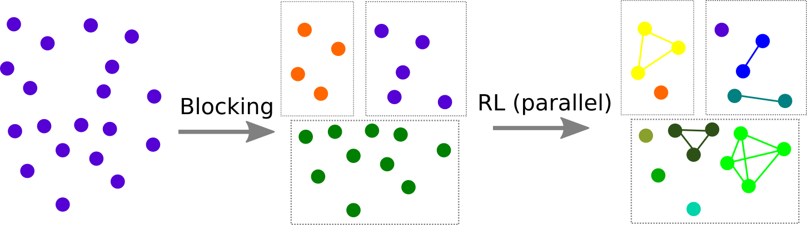
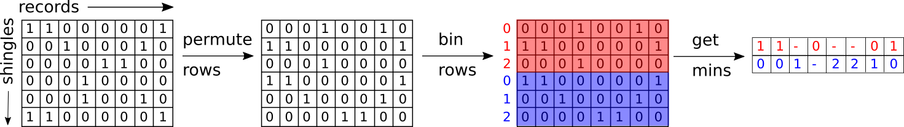

```{r libraries, echo=FALSE, message=FALSE, warning=FALSE}
library(knitr)
library(ggplot2)
library(RecordLinkage)

opts_chunk$set(echo=FALSE, message=FALSE, warning=FALSE)
theme_set(theme_bw(base_family = "serif", base_size = 30))
```

# Goal

**Goal: ** Introduce locality sensitive hashing, a fast method of blocking for record linkage, and get some experience doing LSH in `R`

\vfill



\vfill


# Outline for today

\vfill
1. Defining similarity
\vfill
1. Representing data as sets (shingling)
\vfill
1. Hashing
\vfill
1. Hashing with compression (minhashing)
\vfill
1. Too many pairs to compare! (LSH)
\vfill
1. Evaluation
\vfill
1. Even faster?
\vfill

# Finding similar items

- We want to find similar items
\vfill
    - Maybe we are looking for near duplicate documents (plagiarism)
    \vfill
    - More likely, we are trying to block our data which we can later pass to a record linkage process
    \vfill
- How do we define *similar*?
\vfill

# Jaccard similarity

There are many ways to define similarity, we will use *Jaccard similarity* for this task
$$
Jac(S, T) = \frac{\mid S \cap T\mid}{\mid S \cup T \mid}
$$

 
\begin{figure}[h]
\centering
\includegraphics[width=.5\textwidth]{images/jaccard}
\caption{Two sets S and T with Jaccard similarity 3/7. The two sets share 3 elements in common, and there are 7 elements in total.}
\label{fig:jaccard}
\end{figure}

# How to represent data as sets

We want to talk about similarity of data $\Rightarrow$ we need sets to compare!

- One way is to construct from the data the set of **short strings** that appear within it
\vfill
- Similar documents/datasets will have many common elements, i.e. many commong short strings
\vfill
- We can do construct these short strings using *shingling*
\vfill

# $k$-shingling (how-to)

1. Think of a document or record as a string of characters
\vfill
2. A $k$-shingle (k-gram) is any sub-string (word) of length $k$ found within the document or record
\vfill
3. Associate with each document or record the set of $k$-shingles that appear one or more times within it
\vfill

# Let's try

Suppose our document is the string "Hello world", then 

- the set of $2$-shingles is $\{\text{he, el, ll, lo, ow, wo, or, rl, ld}\}$
\vfill
- the set of $3$-shingles is $\{\text{hel, ell, llo, low, owo, wor, orl, rld}\}$
\vfill

# Your turn

We have the following two records:

```{r your-turn1}
# load RL data
data("RLdata500")

# select only 2 records
records <- RLdata500[129:130, c(1,3)]
names(records) <- c("First name", "Last name")

# inspect records
kable(records)
```

1. Compute the $2$-shingles for each record
\vfill
2. Using Jaccard similarity, how similar are they?
\vfill

# Your turn solution
\vfill
1. The $2$-shingles for the first record are $\{\text{mi, ic, ch, ha, ae, el, lv, vo, og, ge, el}\}$ and for the second are $\{\text{mi, ic, ch, ha, ae, el, lm, me, ey, ye, er}\}$
\vfill
2. There are 6 items in common $\{\text{mi, ic, ch, ha, ae, el}\}$ and 15 items total $\{\text{mi, ic, ch, ha, ae, el, lv, vo, og, ge, lm, me, ey, ye, er}\}$, so the Jaccard similarity is $\frac{6}{15} = \frac{2}{5} = `r 6/15`$
\vfill

# Useful packages/functions in `R`

(Obviously) We don't want to do this by hand most times. Here are some useful packages in `R` that can help us!

```{r helpful-packages, echo = TRUE}
library(textreuse) # text reuse/document similarity
library(tokenizers) # shingles
```

We can use the following functions to create $k$-shingles and calculate Jaccard similarity for our data

```{r helpful-functions, eval=FALSE, echo=TRUE}
# get k-shingles
tokenize_character_shingles(x, n)

# calculate jaccard similarity for two sets
jaccard_similarity(a, b) 
```

# Example data

Research paper headers and citations, with information on authors, title, institutions, venue, date, page numbers and several other fields

\tiny
```{r load-ex-data, echo=TRUE}
library(RLdata) # data library
data(cora) # load the cora data set
str(cora) # structure of cora
```

# Your turn 

Using the `title`, `authors`, and `journal` fields in the `cora` dataset,

\vfill
1. Get the $3$-shingles for each record (**hint:** use `tokenize_character_shingles`)
\vfill
2. Obtain the Jaccard similarity between each pair of records (**hint:** use `jaccard_similarity`)
\vfill

# Your turn (solution)

\tiny

```{r your-turn2-sol, echo=TRUE, cache=TRUE}
# get only the columns we want
n <- nrow(cora) # number of records
dat <- data.frame(id = seq_len(n)) # create id column
dat <- cbind(dat, cora[, c("title", "authors", "journal")]) # get columnds we want

# 1. paste the columns together and tokenize for each record
shingles <- apply(dat, 1, function(x) {
  # tokenize strings
  tokenize_character_shingles(paste(x[-1], collapse=" "), n = 3)[[1]]
})

# 2. Jaccard similarity between pairs
jaccard <- expand.grid(record1 = seq_len(n), # empty holder for similarities
                       record2 = seq_len(n))

# don't need to compare the same things twice
jaccard <- jaccard[jaccard$record1 < jaccard$record2,]

time <- Sys.time() # for timing comparison
jaccard$similarity <- apply(jaccard, 1, function(pair) {
  jaccard_similarity(shingles[[pair[1]]], shingles[[pair[2]]]) # get jaccard for each pair
})
time <- difftime(Sys.time(), time, units = "secs") # timing
```

\normalsize
This took took $`r round(time, 2)`$ seconds $\approx `r round(time/(60), 2)`$ minutes

# Your turn (solution, cont'd)

```{r your-turn2-plot, fig.cap="Jaccard similarity for each pair of records. Light blue indicates the two records are more similar and dark blue indicates less similar."}
# plot the jaccard similarities for each pair of records
ggplot(jaccard) +
  geom_raster(aes(x = record1, y = record2, fill=similarity)) +
  theme(aspect.ratio = 1) +
  scale_fill_gradient("Jaccard similarity") +
  xlab("Record id") + ylab("Record id")
```

# Hashing

For a dataset of size $n$, the number of comparisons we must compute is $\frac{n(n-1)}{2}$ 

\vfill
- For our set of records, we needed to compute $`r scales::comma(nrow(dat)*(nrow(dat) - 1)/2)`$ comparisons
\vfill
- A better approach for datasets of any realistic size is to use *hashing*
\vfill

# Hash functions

- Traditionally, a *hash function* maps objects to integers such that similar objects are far apart
- Instead, we want special hash functions that do the **opposite** of this, i.e. similar objects are placed closed together!


## Definition: Hash function
*Hash functions* $h()$ are defined such that

> If records $A$ and $B$ have high similarity, then the probability that $h(A) = h(B)$ is **high** and if records $A$ and $B$ have low similarity, then the probability that $h(A) \not= h(B)$ is **high**.

# Hashing shingles

Instead of storing the strings (shingles), we can just store the *hashed values*  

These are integers, they will take less space

\footnotesize

```{r hash-tokens, echo=TRUE}
# instead store hash values (less memory)
hashed_shingles <- apply(dat, 1, function(x) {
  string <- paste(x[-1], collapse=" ") # get the string
  shingles <- tokenize_character_shingles(string, n = 3)[[1]] # 3-shingles
  hash_string(shingles) # return hashed shingles
})
```

```{r hash-tokens-jaccard, cache=TRUE}
# Jaccard similarity on hashed shingles
hashed_jaccard <- expand.grid(record1 = seq_len(n), record2 = seq_len(n))

# don't need to compare the same things twice
hashed_jaccard <- hashed_jaccard[hashed_jaccard$record1 < hashed_jaccard$record2,]

time <- Sys.time() # see how long this takes
hashed_jaccard$similarity <- apply(hashed_jaccard, 1, function(pair) {
  jaccard_similarity(hashed_shingles[[pair[1]]], hashed_shingles[[pair[2]]])
}) # get jaccard for each hashed pair
time <- difftime(Sys.time(), time, units = "secs") # timing
```

\normalsize
This took up $`r object.size(hashed_shingles)`$ bytes, while storing the shingles took $`r object.size(shingles)`$ bytes; the whole pairwise comparison still took the same amount of time ($\approx `r round(time/(60), 2)`$ minutes)

# Similarity preserving summaries of sets

- Sets of shingles are large (larger than the original document)
\vfill
- If we have millions of documents, it may not be possible to store all the shingle-sets in memory
\vfill
- We can replace large sets by smaller representations, called *signatures*
\vfill
- And use these signatures to **approximate** Jaccard similarity
\vfill

# Characteristic matrix

In order to get a signature of our data set, we first build a *characteristic matrix* 

Columns correspond to records and the rows correspond to all hashed shingles

```{r characteristic, cache=TRUE}
# return if an item is in a list
item_in_list <- function(item, list) {
  as.integer(item %in% list) 
}

# get the characteristic matrix
# items are all the unique hash values
# columns will be each record
# we want to keep track of where each hash is included 
char_mat <- data.frame(item = unique(unlist(hashed_shingles)))

# for each hashed shingle, see if it is in each row
contained <- lapply(hashed_shingles, function(col) {
  vapply(char_mat$item, FUN = item_in_list, FUN.VALUE = integer(1), list = col)
})

char_mat <- do.call(cbind, contained) # list to matrix
rownames(char_mat) <- unique(unlist(hashed_shingles)) # row names
colnames(char_mat) <- paste("Record", seq_len(nrow(dat))) # column names

# inspect results
kable(char_mat[10:15, 1:5])
```

The result is a $`r dim(char_mat)[1]`\times `r dim(char_mat)[2]`$ matrix

**Question: **Why would we not store the data as a characteristic matrix?

# Minhashing

Want create the signature matrix through minhashing

1. Permute the rows of the characteristic matrix $m$ times
\vspace{.2in}
2. Iterate over each column of the permuted matrix 
\vspace{.2in}
3. Populate the signature matrix, row-wise, with the row index from the first `1` value found in the column 

The signature matrix is a hashing of values from the permuted characteristic matrix and has one row for the number of permutations calculated ($m$), and a column for each record

# Minhashing (cont'd)

```{r minhash-1, cache=TRUE}
# set seed for reproducibility
set.seed(02082018)

# function to get signature for 1 permutation
get_sig <- function(char_mat) {
  # get permutation order
  permute_order <- sample(seq_len(nrow(char_mat)))
  
  # get min location of "1" for each column (apply(2, ...))
  t(apply(char_mat[permute_order, ], 2, function(col) min(which(col == 1))))
}

# repeat many times
m <- 360
sig_mat <- matrix(NA, nrow=m, ncol=ncol(char_mat)) #empty matrix
for(i in 1:m) {
  sig_mat[i, ] <- get_sig(char_mat) #fill matrix
}
colnames(sig_mat) <- colnames(char_mat) #column names

# inspect results
kable(sig_mat[1:10, 1:5])
```

# Signature matrix and Jaccard similarity

The relationship between the random permutations of the characteristic matrix and the Jaccard Similarity is
$$
Pr\{\min[h(A)] = \min[h(B)]\} = \frac{|A \cap B|}{|A \cup B|}
$$

\vfill

We use this relationship to **approximate** the similarity between any two records 

\vfill
We look down each column of the signature matrix, and compare it to any other column

\vfill
The number of agreements over the total number of combinations is an approximation to Jaccard measure

\vfill

# Jaccard similarity approximation

```{r jaccard-sig, fig.height=4, cache=TRUE}
# add jaccard similarity approximated from the minhash to compare
# number of agreements over the total number of combinations
hashed_jaccard$similarity_minhash <- apply(hashed_jaccard, 1, function(row) {
  sum(sig_mat[, row[["record1"]]] == sig_mat[, row[["record2"]]])/nrow(sig_mat)
})

# how far off is this approximation? plot differences
qplot(hashed_jaccard$similarity_minhash - hashed_jaccard$similarity) +
  xlab("Difference between Jaccard similarity and minhash approximation")
```

Used minhashing to get an approximation to the Jaccard similarity, which helps by allowing us to store less data (hashing) and avoid storing sparse data (signature matrix)

We still haven't addressed the issue of **pairwise comparisons**

# Avoiding pairwise comparisons

- Performing pairwise comparisons is time-consuming because the number of comparisons grows at $O(n^2)$
\vfill
- Most of those comparisons are **unnecessary** because they do not result in matches due to sparsity 
\vfill
- We will use the combination of minhash and locality-sensitive hashing (LSH) to compute possible matches only once for each document, so that the cost of computation grows **linearly**
\vfill

# Locality Sensitive Hashing (LSH)

**Idea: ** We want to hash items several times such that similar items are more likely to be hashed into the same bucket

1. Divide signature matrix into $b$ bands with $r$ rows each so $m = b * r$ where *m* is the number of times that we drew a permutation of the characteristic matrix in the process of minhashing
2. Each band is hashed to a bucket by comparing the minhash for those permutations 
    - If they match within the band, then they will be hashed to the same bucket
3. If two documents are hashed to the same bucket they will be considered candidate pairs 
  
We only check *candidate pairs* for similarity

# Banding and buckets

```{r banding, results='asis'}
# view the signature matrix
print(xtable::xtable(sig_mat[1:10, 1:5]), hline.after = c(-1,0,5,10), comment=F)
```

# Tuning

## How to choose $k$

How large $k$ should be depends on how long our data strings are

The important thing is $k$ should be picked large enough such that the probability of any given shingle is *low*

## How to choose $b$

$b$ must divide $m$ evenly such that there are the same number of rows $r$ in each band 

What else?

# Choosing $b$

\vspace{-.2in}
\scriptsize
$$
P(\text{two documents w/ Jaccard similarity } s \text{ marked as potential match}) = 1 - (1 - s^{m/b})^b
$$

\normalsize

```{r inclusion-probs, fig.cap=paste0("Probability that a pair of documents with a Jaccard similarity $s$ will be marked as potential matches for various bin sizes $b$ for $s = .25, .75$ for the number of permutations we did, $m = ", m, "$."), fig.height=3}
# library to get divisors of m
library(numbers) 

# look at probability of binned together for various bin sizes and similarity values
bin_probs <- expand.grid(s = c(.25, .75), h = m, b = divisors(m))
bin_probs$prob <- apply(bin_probs, 1, function(x) lsh_probability(x[["h"]], x[["b"]], x[["s"]]))


# plot as curves
ggplot(bin_probs) +
  geom_line(aes(x = prob, y = b, colour = factor(s), group = factor(s)), size = 2) +
  geom_point(aes(x = prob, y = b, colour = factor(s)), size = 3) +
  xlab("Probability") +
  scale_color_discrete("s")
  
```

For $b = 90$, a pair of records with Jaccard similarity $.25$ will have a `r scales::percent(bin_probs[bin_probs$b == 90 & bin_probs$s == .25, "prob"])` chance of being matched as candidates and a pair of records with Jaccard similarity $.75$ will have a `r scales::percent(bin_probs[bin_probs$b == 90 & bin_probs$s == .75, "prob"])` chance of being matched as candidates

# "Easy" LSH in R

There an easy way to do LSH using the built in functions in the `textreuse` package via the functions `minhash_generator` and `lsh` (so we don't have to perform it by hand): 

\tiny
```{r show-package-lsh, echo=TRUE, cache=TRUE}
# choose appropriate num of bands
b <- 90

# create the minhash function
minhash <- minhash_generator(n = m, seed = 02082018)

# build the corpus using textreuse
docs <- apply(dat, 1, function(x) paste(x[-1], collapse = " ")) # get strings
names(docs) <- dat$id # add id as names in vector
corpus <- TextReuseCorpus(text = docs, # dataset
                          tokenizer = tokenize_character_shingles, n = 3, simplify = TRUE, # shingles
                          progress = FALSE, # quietly
                          keep_tokens = TRUE, # store shingles
                          minhash_func = minhash) # use minhash

# perform lsh to get buckets
buckets <- lsh(corpus, bands = b, progress = FALSE)

# grab candidate pairs
candidates <- lsh_candidates(buckets)

# get Jaccard similarities only for candidates
lsh_jaccard <- lsh_compare(candidates, corpus, jaccard_similarity, progress = FALSE)
```

# "Easy" LSH in R (cont'd)

```{r, lsh-plot}
# plot jaccard similarities that are candidates
qplot(lsh_jaccard$score)
```


# Putting it all together

The last thing we need is to go from candidate pairs to blocks

\footnotesize
```{r, echo=TRUE}
library(igraph) #graph package

# think of each record as a node
# there is an edge between nodes if they are candidates
g <- make_empty_graph(n, directed = FALSE) # empty graph
g <- add_edges(g, as.vector(t(candidates[, 1:2]))) # candidate edges
g <- set_vertex_attr(g, "id", value = dat$id) # add id

# get custers, these are the blocks
clust <- components(g, "weak") # get clusters
blocks <- data.frame(id = V(g)$id, # record id
                     block = clust$membership) # block number  
head(blocks)
```

# Your turn

Using the `fname_c1` and `lname_c1` columns in the `RecordLinkage::RL500` dataset, 

1. Use LSH to get candidate pairs for the dataset
  - What $k$ to use for shingling?
  - What $b$ to use for bucket size?
  
2. Append the blocks to the original dataset as a new column, `block`

# Even faster?

(**fast**): In minhashing we have to perform $m$ permutations to create multiple hashes
\vfill
(**faster**): We would like to reduce the number of hashes we need to create -- "Densified" One Permutation Hashing (DOPH)
\vfill

- One permutation of the signature matrix is used
- The feature space is then binned into $m$ evenly spaced bins
- The $m$ minimums (for each bin separately) are the $m$ different hash values

\vfill

# "Densified" One Permutation Hashing (DOPH)




